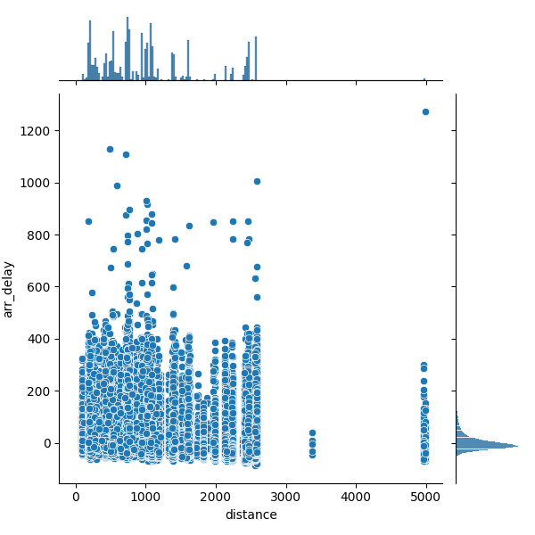
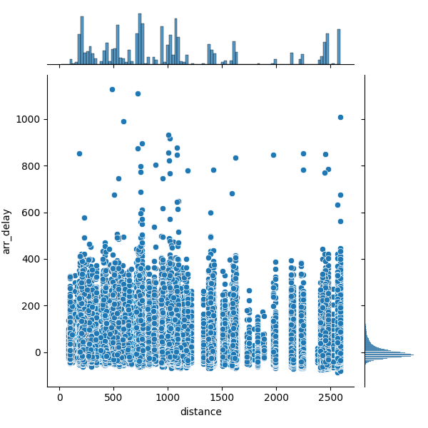
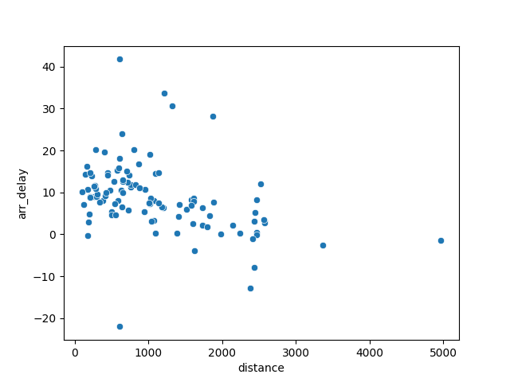

## Data
The [nycflights13](https://github.com/tidyverse/nycflights13) database is available in the
[rdata](https://github.com/ds5110/rdata/tree/main/data) repo both as a collection of CSV files 
and as a SQLite database.


### Question 1
Q: If you visualize the scatterplot of `arr_delay` and `distance` in the flights table, you'll notice a couple `distance` outliers. Explain the source of these outliers, and remove them from the flights table. Then plot distance vs arr_delay using a seaborn joint histogram. After filtering, describe the most interesting features relevant to the "story". Keep your description to one or two sentences.

A: Flights to or from Hawaii or Alaska are likely the distance outliers because they have substantially longer distances than the other US flights.
The majority of flights, regardless of distance, arrive with a delay of 0 to 15 minutes after removing these faults, which is the most intriguing aspect of the combined histogram. 

Full Dataframe:



Outliers Removed:




### Question 2
Q: Recall the central limit theorem, where the averaging of random data with arbitrary distributions tends to reduce variance and create normally distributed averages. Group the flights data by destination and average them. Produce a scatterplot that more clearly visualizes a potential relationship between `arr_delay` and `distance.` Briefly explain your conclusion.

A: When the data is grouped by destination and the arr delay and distance variables are averaged, we can see that flights with shorter distances have shorter delays.
This implies that longer flights have a higher risk of delay due to the increased flight time, which makes delays more likely. 



### Question 3
Q: Given that the primary key for a table in a RDBMS must be unique and that you can use multiple fields as a key, can the grayed fields in the flights table be used as a primary key for the flights table? Write a short python program that reads flights.csv to demonstrate your answer. 

```
# Combine as unique boolean???
unique_key = flights.groupby(['carrier', 'flight', 'year', 'month', 'day']).size().max() == 1

# Returns false
print(unique_key)
```

A: No, because they are not guaranteed to be unique, the grayed fields in the flights table cannot be used as a primary key.
There may be multiple flights with the same carrier and flight number on the same day. 


### Question 4
Q: Write two SQL queries -- one using a JOIN and the other using WHERE -- to produce the following:
* print the carrier, tail number, month and day for each flight
* order the results by these fields (in the order specified)
* get only those flights for which the plane is a made by "AIRBUS INDUSTRIE"
* get only the first 10 flights

The two queries should produce the same results. For your solution...

* Include the two queries in this README.md (using make)
* Include the results of the two queries in your README.md (also using markdown for code).

A: 

SQL using JOIN:
```
SELECT 
    f.carrier, 
    f.tailnum, 
    f.month, 
    f.day 
FROM 
    flights f 
JOIN 
    planes p ON f.tailnum = p.tailnum 
WHERE 
    p.manufacturer = 'AIRBUS INDUSTRIE' 
ORDER BY 
    f.carrier, f.tailnum, f.month, f.day 
LIMIT 10;
```
Result:
| carrier | tailnum | month | day |
|---------|---------|-------|-----|
| B6      | N503JB  | 1     | 1   |
| B6      | N503JB  | 1     | 1   |
| B6      | N503JB  | 1     | 7   |
| B6      | N503JB  | 1     | 8   |
| B6      | N503JB  | 1     | 12  |
| B6      | N503JB  | 1     | 12  |
| B6      | N503JB  | 1     | 13  |
| B6      | N503JB  | 1     | 14  |
| B6      | N503JB  | 1     | 16  |
| B6      | N503JB  | 1     | 16  |


SQL using WHERE:
```
SELECT 
    f.carrier, 
    f.tailnum, 
    f.month, 
    f.day 
FROM 
    flights f, 
    planes p 
WHERE 
    f.tailnum = p.tailnum 
    AND p.manufacturer = 'AIRBUS INDUSTRIE' 
ORDER BY 
    f.carrier, f.tailnum, f.month, f.day 
LIMIT 10;
```

Result:
| carrier | tailnum | month | day |
|---------|---------|-------|-----|
| B6      | N503JB  | 1     | 1   |
| B6      | N503JB  | 1     | 1   |
| B6      | N503JB  | 1     | 7   |
| B6      | N503JB  | 1     | 8   |
| B6      | N503JB  | 1     | 12  |
| B6      | N503JB  | 1     | 12  |
| B6      | N503JB  | 1     | 13  |
| B6      | N503JB  | 1     | 14  |
| B6      | N503JB  | 1     | 16  |
| B6      | N503JB  | 1     | 16  |